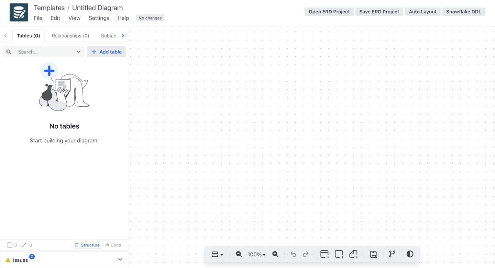
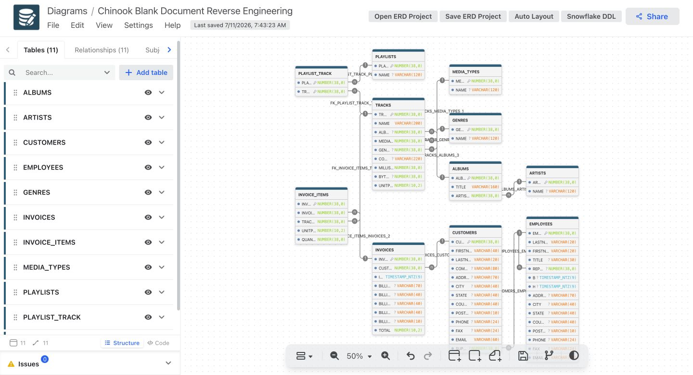

# Tutorial: Reverse Engineer SQLite into a New Blank ERD Document

This is a clean-document workflow: begin with an empty Snowflake ERD canvas,
reverse engineer the SQLite structure, import it, arrange it, and save it.

## 1. Create a blank Snowflake ERD document

Start the desktop application with `cd desktop && npm run start:electron`.
Create a blank document, choose **Snowflake**, and select **Confirm**.



## 2. Reverse engineer the SQLite database

Generate the canonical project from the Chinook SQLite database:

```bash
cd erd-tool
python3 -m venv .venv
source .venv/bin/activate
python -m pip install -e .
erd-tool sqlite-import \
  /path/to/chinook.db \
  --name "Chinook Blank Document Reverse Engineering" \
  --catalog ERD_TOOL_CHINOOK \
  --schema PUBLIC \
  --output /tmp/chinook-blank-document.erd.json
```

The generated project has 11 tables and 11 relationships.

## 3. Import into the blank document

Select **Open ERD Project** in the blank document and choose
`/tmp/chinook-blank-document.erd.json`. The editor replaces the empty canvas
with the canonical ER model while keeping all diagram state separate from the
schema model.

## 4. Make the layout presentation-ready

Select **Auto Layout**. Then open the zoom menu and choose **Fit window /
Reset**. This keeps the table and relationship graph readable as a single
model instead of leaving the imported objects off-canvas.



## 5. Save the document

The editor persists the document locally; the title becomes **Chinook Blank
Document Reverse Engineering** and the status shows **Last saved**. Select
**Save ERD Project** whenever you also want a downloadable JSON copy.

The original reverse-engineered source file remains available at
`/tmp/chinook-blank-document.erd.json`.
