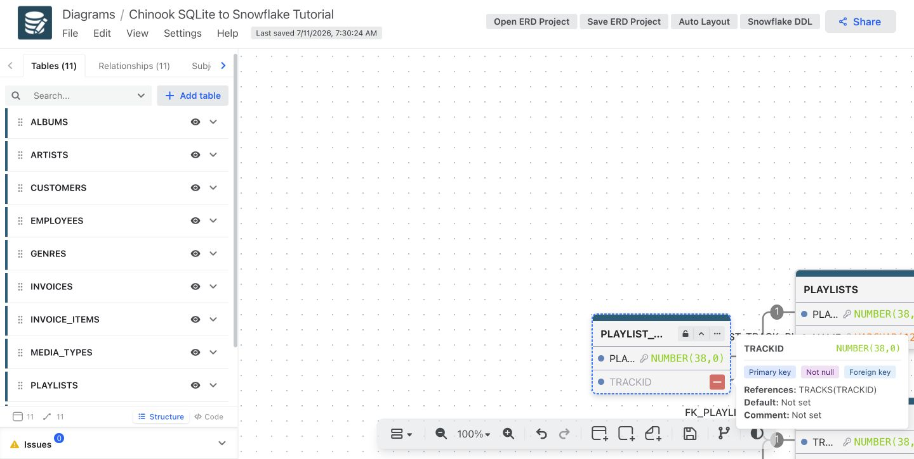
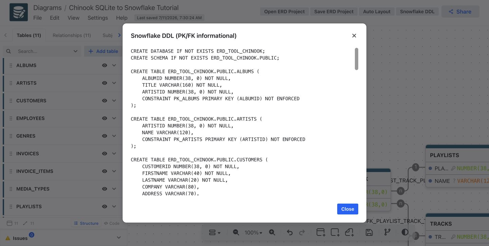
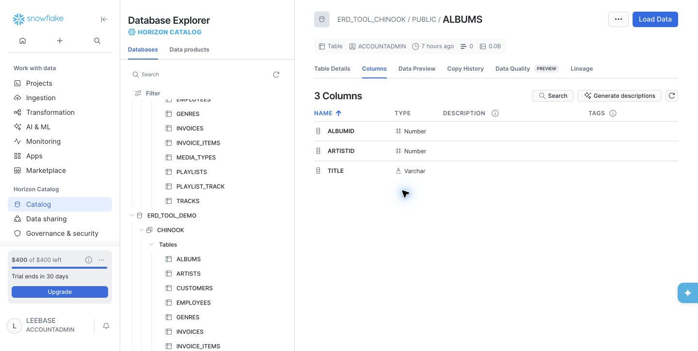

# Tutorial: Chinook SQLite to Snowflake ER Model

This tutorial moves database structure, not row data. It creates a canonical ERD
project from a local SQLite database, lets you inspect and edit it in ERD Tool,
then generates Snowflake DDL to apply with your own connection.

## 1. Start the editor

```bash
git clone https://github.com/leebase/erd-tool.git
cd erd-tool/desktop
npm ci
npm run start:electron
```

The Electron window is the editor; no browser address is required.

## 2. Reverse engineer SQLite

Download the official Chinook SQLite sample database, then run:

```bash
cd erd-tool
python3 -m venv .venv
source .venv/bin/activate
python -m pip install -e .
erd-tool sqlite-import /path/to/chinook.db \
  --name "Chinook SQLite to Snowflake" \
  --catalog ERD_TOOL_CHINOOK \
  --schema PUBLIC \
  --output /tmp/chinook.erd.json

erd-tool project-check /tmp/chinook.erd.json
```

Expected Chinook result: 11 tables and 11 relationships.

## 3. Inspect and edit the ER model

In the editor, select **Open ERD Project**, choose `/tmp/chinook.erd.json`,
and then select **Auto Layout**. You can edit names, columns, and relationships;
use **Save ERD Project** to download the revised canonical project.



## 4. Preview Snowflake DDL

Select **Snowflake DDL**. The preview maps SQLite structure to legal Snowflake
identifiers and types, including `NUMBER`, `VARCHAR`, and `TIMESTAMP_NTZ`.

PK, UNIQUE, and FK constraints are deliberately emitted with `NOT ENFORCED`.
They describe the ER model to Snowflake but do not cause Snowflake to enforce
the relationship. The renderer never adds `RELY` automatically.



## 5. Forward engineer the structure

Render the project to a SQL file:

```bash
erd-tool render-ddl \
  /tmp/chinook.erd.json --output /tmp/chinook.snowflake.sql
```

Apply the generated structure using the local key-pair connection:

```bash
snow sql --connection YOUR_CONNECTION --filename /tmp/chinook.snowflake.sql
```

## 6. Verify in Snowflake

This read-only query verifies the migrated structure:

```sql
SELECT
  (SELECT COUNT(*) FROM ERD_TOOL_CHINOOK.INFORMATION_SCHEMA.TABLES
   WHERE TABLE_SCHEMA = 'PUBLIC' AND TABLE_TYPE = 'BASE TABLE') AS tables,
  (SELECT COUNT(*) FROM ERD_TOOL_CHINOOK.INFORMATION_SCHEMA.COLUMNS
   WHERE TABLE_SCHEMA = 'PUBLIC') AS columns,
  (SELECT COUNT(*) FROM ERD_TOOL_CHINOOK.INFORMATION_SCHEMA.TABLE_CONSTRAINTS
   WHERE CONSTRAINT_SCHEMA = 'PUBLIC' AND CONSTRAINT_TYPE = 'PRIMARY KEY') AS primary_keys,
  (SELECT COUNT(*) FROM ERD_TOOL_CHINOOK.INFORMATION_SCHEMA.TABLE_CONSTRAINTS
   WHERE CONSTRAINT_SCHEMA = 'PUBLIC' AND CONSTRAINT_TYPE = 'FOREIGN KEY') AS foreign_keys,
  (SELECT COUNT(*) FROM ERD_TOOL_CHINOOK.INFORMATION_SCHEMA.TABLE_CONSTRAINTS
   WHERE CONSTRAINT_SCHEMA = 'PUBLIC' AND ENFORCED = 'YES') AS enforced_constraints;
```

For the demonstrated Chinook migration, expected values are 11 tables, 64
columns, 11 primary keys, 11 foreign keys, and 0 enforced constraints.


